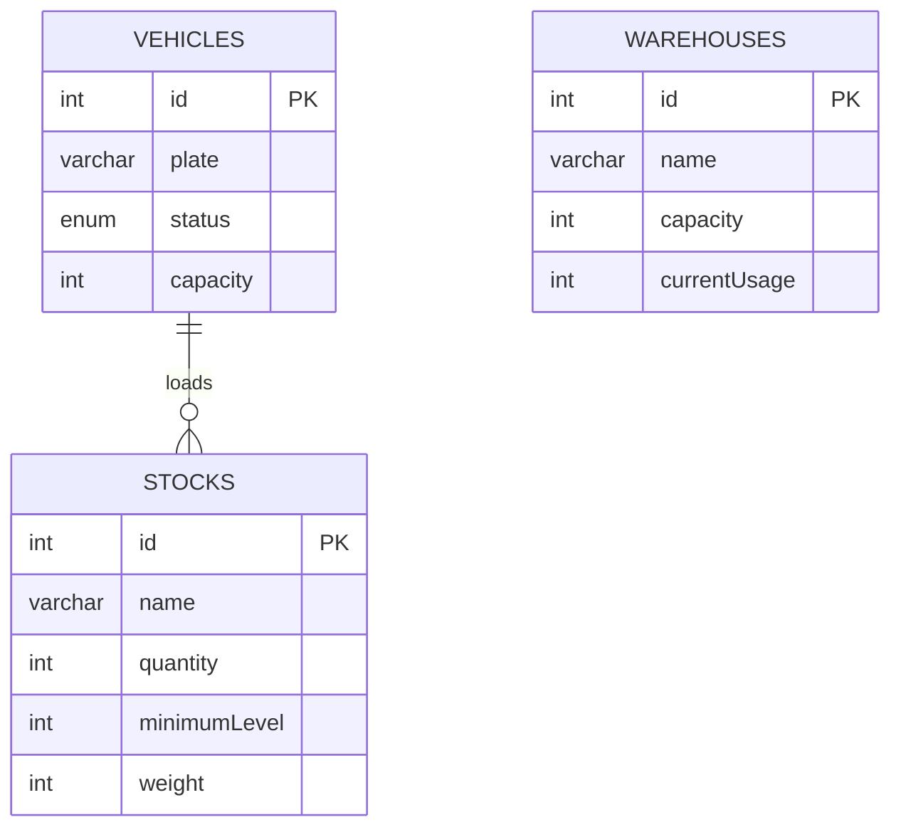

# IMRA Lojistik Karar Destek Sistemi (KDS)

## Projenin Amacı ve Kısa Tanımı

Bu proje, Sunucu Tabanlı Programlama dersi ödevi için geliştirilen bir lojistik karar destek sistemi'nin backend kısmıdır. Express.js ve MySQL kullanarak MVC mimarisi ile araçlar, stoklar ve depoların yönetimini sağlar. Sistem, filo yönetimi, yedek parça stok takibi ve depo kapasite kararlarını destekler.

## Senaryo Tanımı

### İş Kuralları (Business Rules)

1. **Araç Kapasitesi Kontrolü**: Bir araca kapasitesinden fazla stok yüklenemez. Araç kapasitesi (Vehicle.capacity) ile yüklenen ürünün toplam ağırlığı (quantity * stock.weight) karşılaştırılır. Eğer kapasite aşılırsa yükleme işlemi engellenir.

2. **Stok Kritik Seviye Uyarısı**: Stok miktarı 10'un altına düşen bir ürün için "kritik seviye" uyarısı verilir. Stok miktarı 0 ise çıkış işlemi tamamen engellenir.

## Özellikler

- MVC mimarisi (Models, Views, Controllers)
- RESTful API endpoints
- MySQL veritabanı entegrasyonu
- İş kuralları entegrasyonu
- Hata yönetimi ve response standartizasyonu

## Kurulum Adımları

1. **Bağımlılıkları yükleyin**:
   ```
   npm install
   ```

2. **Veritabanı Yapılandırması**:
   - .env dosyasını .env.example'dan kopyalayın ve aşağıdaki değişkenleri doldurun:
     ```
     DB_HOST=localhost
     DB_USER=root
     DB_PASS=your_password
     DB_NAME=lojistik_kds
     PORT=3000
     ```
   - MySQL'de veritabanını oluşturun ve tabloları ekleyin:
     ```
     mysql -u root -p < db/init.sql
     ```

3. **Sunucuyu başlatın**:
   ```
   npm start
   ```

## API Endpoint Listesi

### Vehicles (Araçlar)
- `GET /api/vehicles` - Tüm araçları listele
- `GET /api/vehicles/:id` - Belirli bir aracı getir
- `POST /api/vehicles` - Yeni araç oluştur
- `PUT /api/vehicles/:id` - Araç güncelle
- `POST /api/vehicles/:id/load-stock` - Araç kapasitesi kontrolü ile stok yükle (body: {stockId, quantity})
- `DELETE /api/vehicles/:id` - Araç sil

### Stocks (Stoklar)
- `GET /api/stocks` - Tüm stokları listele
- `GET /api/stocks/:id` - Belirli bir stoğu getir
- `POST /api/stocks` - Yeni stok oluştur
- `PUT /api/stocks/:id` - Stok güncelle
- `PUT /api/stocks/:id/reduce` - Stok çıkış işlemi (body: {quantity})
- `DELETE /api/stocks/:id` - Stok sil

### Warehouses (Depolar)
- `GET /api/warehouses` - Tüm depoları listele
- `GET /api/warehouses/:id` - Belirli bir depoyu getir
- `POST /api/warehouses` - Yeni depo oluştur
- `PUT /api/warehouses/:id` - Depo güncelle
- `DELETE /api/warehouses/:id` - Depo sil

## ER Diyagramı



## MVC Yapısı

- **Routes**: API endpoint tanımları
- **Controllers**: İş mantığı, request/response yönetimi ve iş kuralları
- **Models**: Veritabanı sorguları ve CRUD işlemleri
- **Utils**: Yardımcı sınıflar (Response, Error handling)
- **Config**: Veritabanı bağlantısı
- **Middlewares**: Loglama ve doğrulama

## İş Kuralları

1. Bakımda olan bir araç güncellenemez.
2. Yedek parça stok miktarı minimum seviyenin altındaysa güncellenemez.
# IMRA Lojistik Karar Destek Sistemi (KDS)

Bu proje, Sunucu Tabanlı Programlama dersi için geliştirilen bir Karar Destek Sistemi'nin backend kısmıdır. MVC mimarisi ve RESTful API prensipleri kullanılarak tasarlanmıştır.

## Senaryo Tanımı

IMRA Lojistik firması filo yönetimi, yedek parça stokları ve depo kapasite kararlarını desteklemektedir. Sistem araçları, yedek parçaları ve depo doluluk oranlarını yönetir.

## Özellikler

- MVC mimarisi
- RESTful API
- CRUD işlemleri
- İş kuralları entegrasyonu

## Kurulum Adımları

1. Bağımlılıkları yükleyin:
   ```
   npm install
   ```

2. .env dosyasını .env.example'dan kopyalayın ve veritabanı bilgilerini doldurun.

3. Veritabanını oluşturun ve tabloları ekleyin (phpMyAdmin üzerinden mevcut DB'yi kullanın).

4. Sunucuyu başlatın:
   ```
   npm start
   ```

## API Endpoint Listesi

### Vehicles
- GET /api/vehicles
- GET /api/vehicles/:id
- POST /api/vehicles
- PUT /api/vehicles/:id
- DELETE /api/vehicles/:id

### Spare Parts
- GET /api/spare-parts
- GET /api/spare-parts/:id
- POST /api/spare-parts
- PUT /api/spare-parts/:id
- DELETE /api/spare-parts/:id

### Warehouses
- GET /api/warehouses
- GET /api/warehouses/:id
- POST /api/warehouses
- PUT /api/warehouses/:id
- DELETE /api/warehouses/:id

## İş Kuralları

1. Yedek parça stok seviyesi minimumun altındaysa sipariş oluşturulamaz.
2. Kapasite %90 üzerindeyse depo silinemez.

## ER Diyagramı

[ER Diyagramı](er_diagram.png) (PNG/PDF olarak ekleyin)

## MVC Yapısı

- **Routes**: Sadece endpoint tanımları
- **Controllers**: Request/Response yönetimi ve iş kuralları
- **Models**: MySQL sorguları ve CRUD işlemleri
- **Config**: Veritabanı bağlantısı
